# TBH Analizer

A local analysis tool for **TBH: Task Bar Hero** (Steam). It watches your game while you play and
answers the questions the game itself does not: where you earn the most gold per hour, where each
hero gains the most XP, how strong your party is against the next stage or act boss, what is in your
inventory and stash, and what your runes, gear and attribute points actually change.

Everything runs on your own PC. A small Python backend reads the game and keeps a local history
in SQLite. A web page served on `127.0.0.1` shows the analyses. Nothing is sent anywhere.

> Unofficial fan project, not affiliated with or endorsed by the game's developers.
> It only reads: it never writes game memory, never edits saves and never changes game files.

## Screenshots

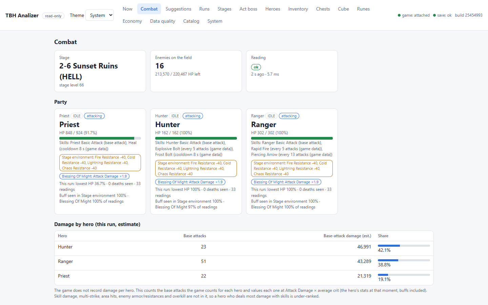

<p>
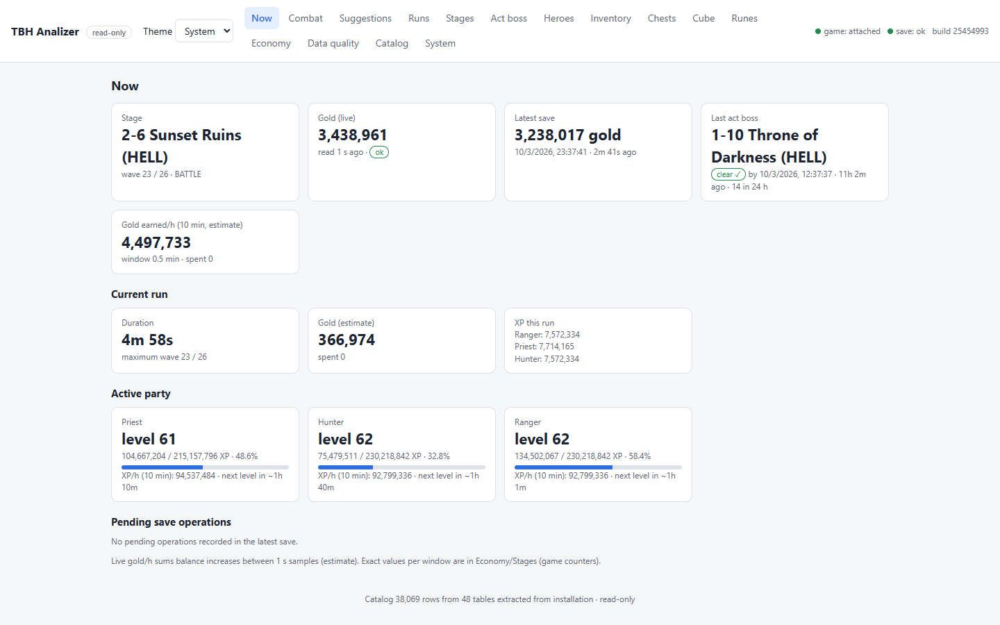 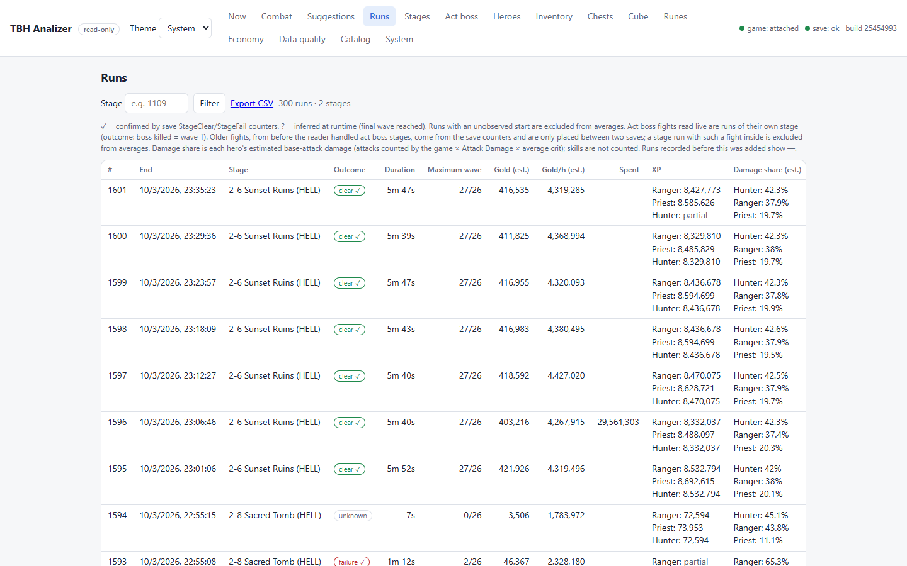
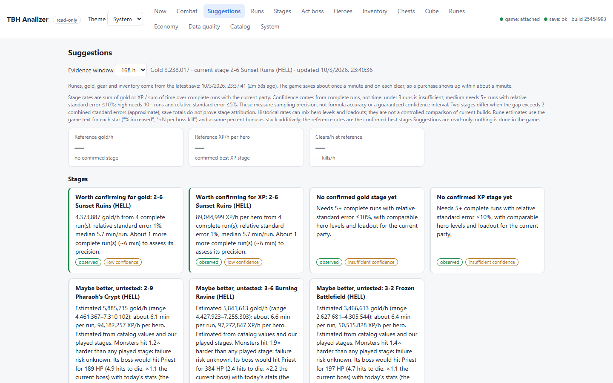 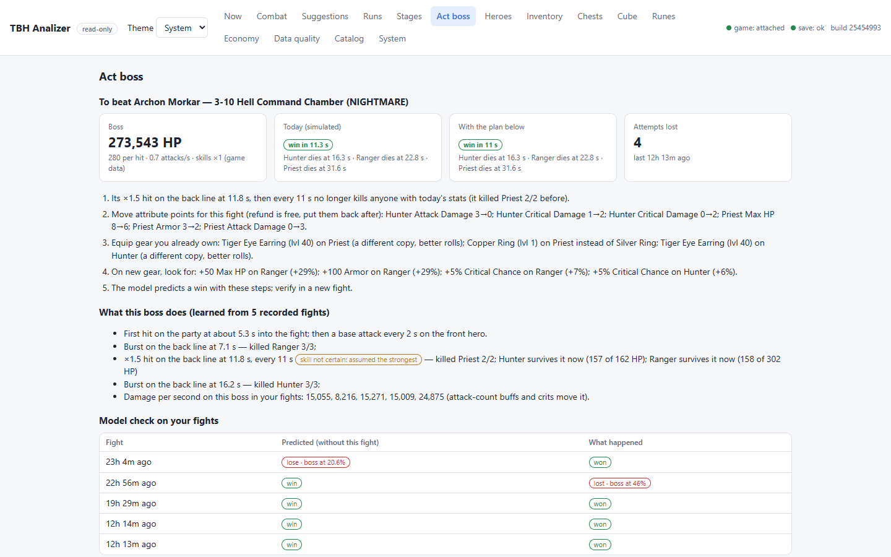
</p>

<details>
<summary>All views</summary>

**Stages**

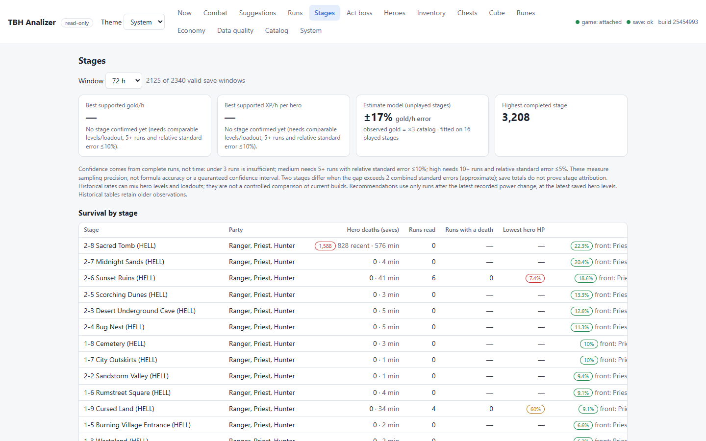

**Heroes**

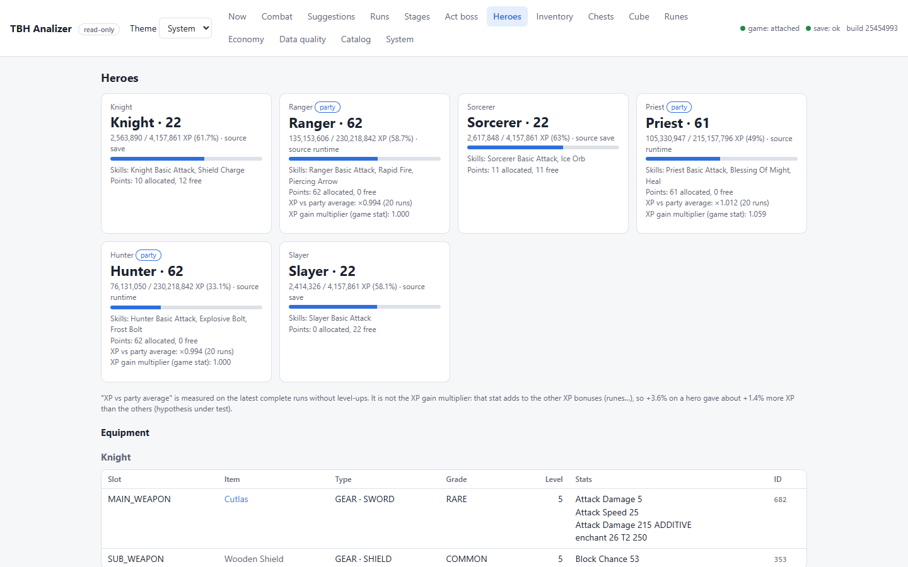

**Inventory and stash**

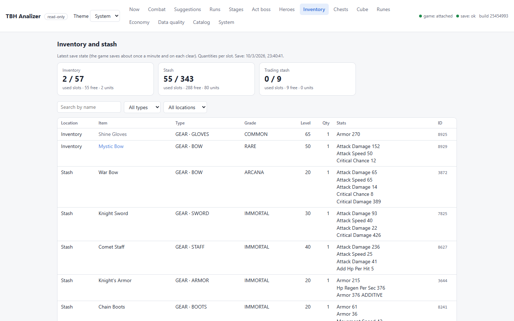

**Chests**

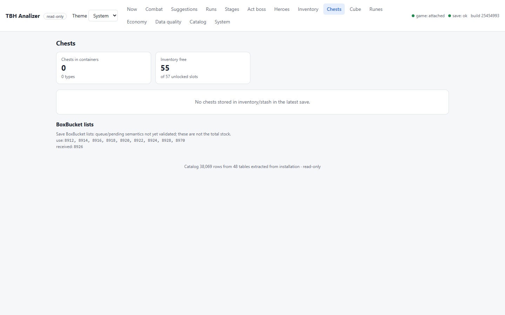

**Cube**

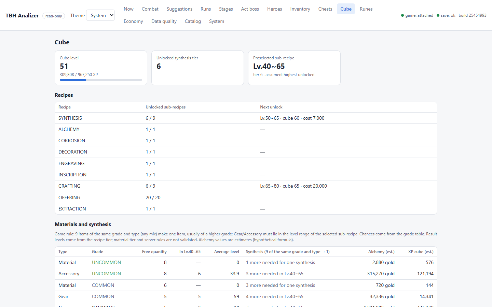

**Runes**

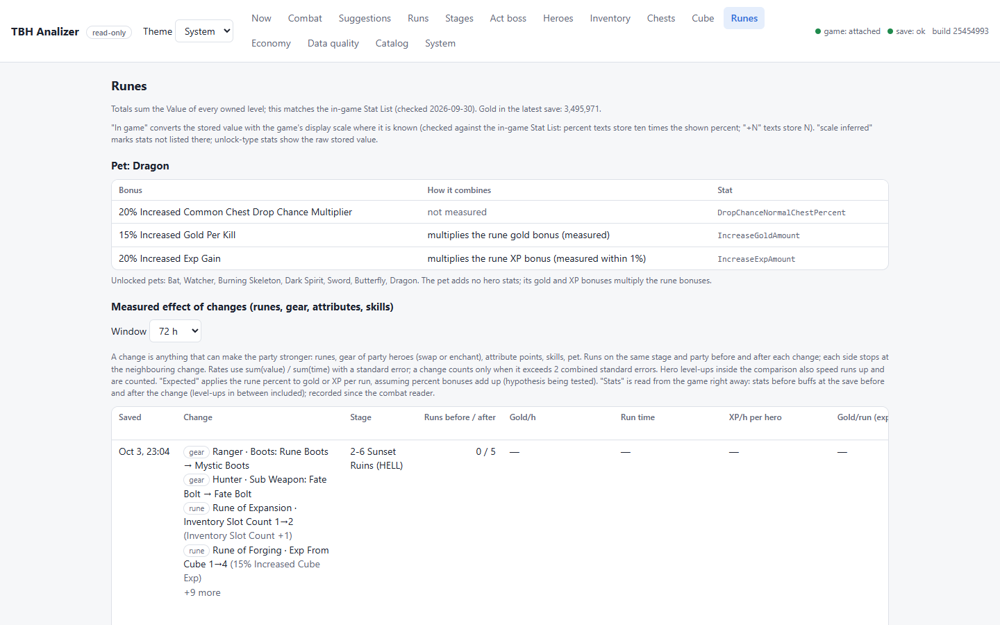

**Economy**

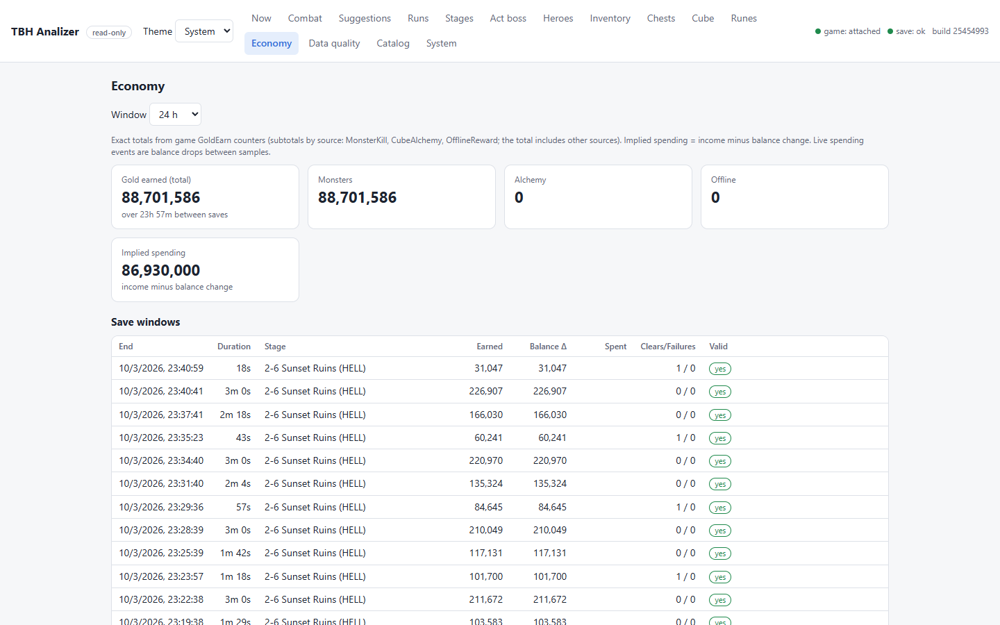

**Data quality**

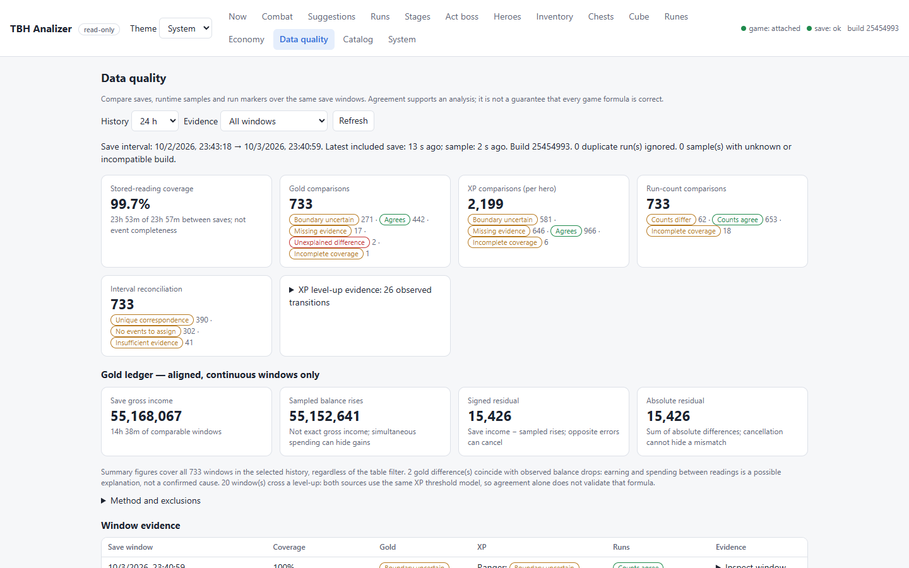

**Catalog**

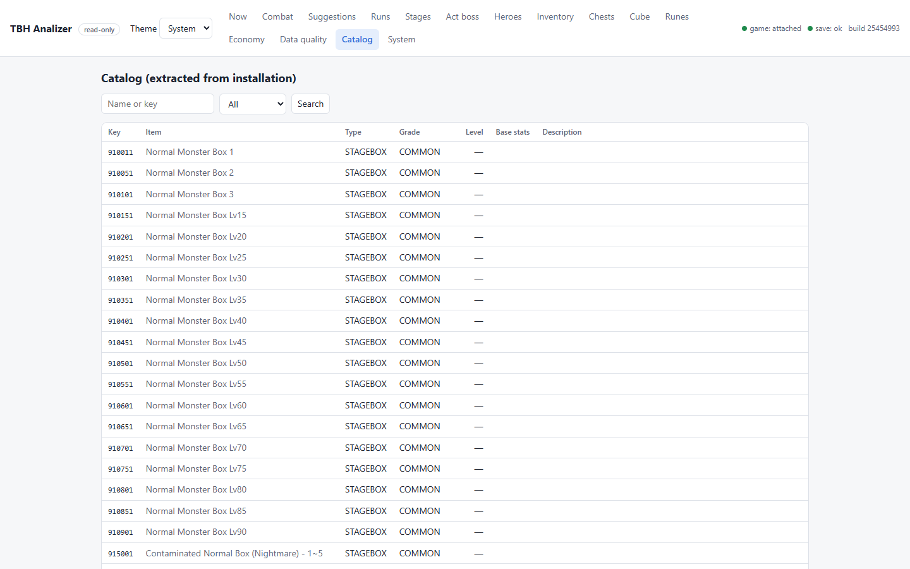

**System**

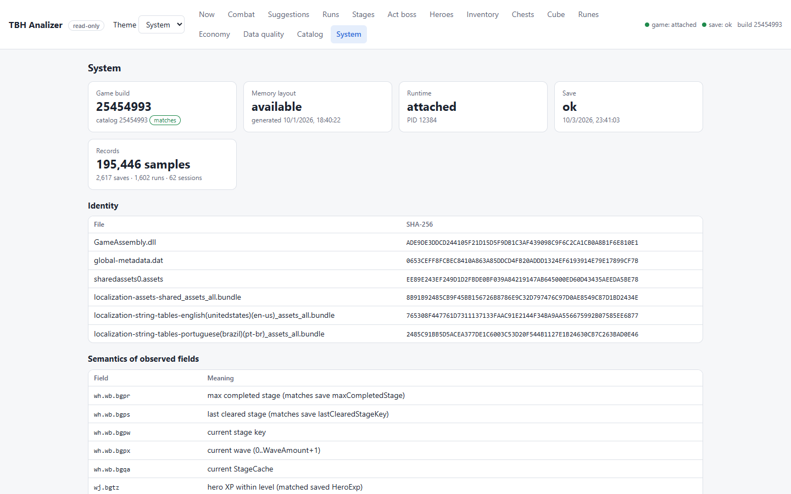

</details>

## What it shows

| View | What you get |
|------|--------------|
| **Now** | Current stage, wave and state, gold, hero levels and XP, and the run in progress. |
| **Combat** | Party HP, stats and where each stat comes from (gear, attributes, passives, runes, buffs). Also active buffs, resistances, damage taken per hit from each enemy, enemy HP, and estimated damage by hero. |
| **Runs** | Every stage run, with duration, outcome (confirmed against the save counters), gold, gold/h, XP per hero and each hero's share of the damage. CSV export. |
| **Stages** | Gold/h and XP/h per stage with confidence ranges, the best stage for each, and estimates for stages you have not played yet. |
| **Suggestions** | Where to farm next, what to fix before a harder stage, which upgrades paid off, cube synthesis you can do now. |
| **Act boss** | For a lost act boss fight: how the boss fights (learned from your recorded fights), a simulation of the fight today and with a point and gear plan, and how much HP each hero needs to survive. |
| **Heroes** | Levels, XP to the next level and equipped gear. |
| **Inventory / Chests / Cube** | Contents of inventory and stash per slot, chests in stock, and cube synthesis options per grade and level range. |
| **Runes** | The rune tree, totals per stat, and the measured effect of each purchase on gold/h, XP/h and run time. |
| **Economy** | Gold earned and spent over time, from the save counters. |
| **Data quality** | How much of the play time is covered by readings, and where live readings and save counters agree or differ. |
| **Catalog** | Every item, monster and stage from the game's own data tables. |

## How it works

- **Game data.** Item, monster, stage, rune and level tables are extracted from the installed game
  files (`sharedassets0.assets`). Each extraction records the game build and file hashes, so
  numbers always come from the game itself, never from a wiki.
- **Live readings.** About once per second the collector reads stage, wave, gold, hero XP, combat
  state and enemies from the game process. This uses read-only process memory access.
  Field offsets come from a layout generated for the exact game build. When the game updates, the
  old layout is refused instead of guessed.
- **Saves.** The ES3 save is decrypted and decoded each time the game writes it. Save counters
  (stage clears/fails, gold earned, kills) confirm the outcomes that the live readings infer.
- **Evidence first.** Every figure keeps its source, time and quality. Unknown is never shown as
  zero. Estimates are labelled as estimates and come with how many runs support them.

## Requirements

- Windows 10/11 (x64) with TBH: Task Bar Hero installed from Steam.
- Python 3.12 or newer.
- The ES3 password of the save file, to read saves. It is not included in this repository.

## Setup

```powershell
git clone <this repository> tbh-analizer
cd tbh-analizer
python -m venv .venv
.venv\Scripts\python -m pip install -r requirements.txt
```

Create `build/app/local.json`. It is local only and never committed:

```json
{
  "install_dir": "D:\\SteamLibrary\\steamapps\\common\\TaskbarHero",
  "es3_password": "<save password>"
}
```

`install_dir` is only needed if the game is not in the default Steam library. You can also use the
environment variables `TBH_ES3_PASSWORD`, `TBH_PORT` and `TBH_DATA_DIR`.

Then start it and open http://127.0.0.1:8765:

```powershell
.venv\Scripts\python -m tbh serve
```

On startup `serve` checks the installed game build, extracts the game data tables the first time
(about two seconds) and picks the memory layout for your `GameAssembly.dll`. Layouts for supported
builds ship in `tbh/layouts/`, so no extra step is needed. The console log shows what it found.
Leave `serve` running while you play: runs, rates and suggestions improve as history builds up.

## Commands

| Command | Purpose |
|---------|---------|
| `serve [--port N] [--no-collect]` | Start the collector and the web portal. `--no-collect` only serves stored data. |
| `catalog` | Extract the game data tables again (`serve` does it when they are missing). |
| `layout --dump <folder>` | Generate a memory layout for a build that has none shipped (see below). |
| `status` | Check build identity, catalog, layout and one live reading, without starting the server. |
| `import-saves [--folder F]` | Import existing save copies into the history. |
| `rebuild-runs` | Rebuild runs from the stored readings (after an analysis fix). |
| `import-capture <file>` | Import a JSONL capture of readings. |

Only one server collects per data folder. A second one serves the stored data read-only.

## Project layout

```
tbh/catalog    game data extraction and lookup
tbh/runtime    process attach, memory layout and live readers (game state, combat)
tbh/layouts    memory layouts of supported game builds (field offsets only)
tbh/save       ES3 save decryption and normalisation
tbh/analysis   runs, economy, XP, stage statistics, combat formulas, boss profiles, data quality
tbh/views      API payloads for each portal view
tbh/collector.py, tbh/store.py, tbh/server.py   sampling loop, SQLite history, HTTP API
web/           the portal (plain HTML/CSS/JS, no build step)
tests/         unit tests on synthetic data (no game needed)
tools/         offline audits of the stored history
```

## Tests

```powershell
.venv\Scripts\python -m unittest discover -s tests -t .
```

## Game updates

A new game build changes offsets and obfuscated names. The catalog is extracted again on
its own. Live readings stay off until a layout for the new build exists: either one ships in
a later version of this repository, or you generate it yourself from an IL2CPP dump (`dump.cs` +
`script.json`, e.g. made with Il2CppDumper from your own installation) with
`python -m tbh layout --dump <folder>`. Saves and stored history keep working in the meantime.
A layout is matched to the exact SHA-256 of `GameAssembly.dll`, never guessed from another build.

## License

MIT, see [LICENSE](LICENSE). This repository contains no game files or extracted game code: the
game data tables are read from your own installation, and the shipped layouts hold only field
offsets and names needed to read the game state.
